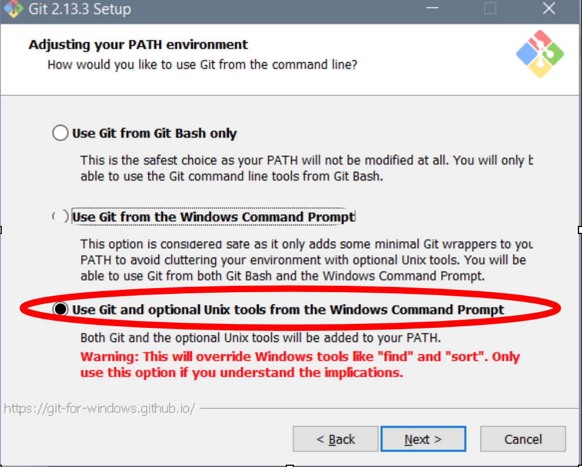
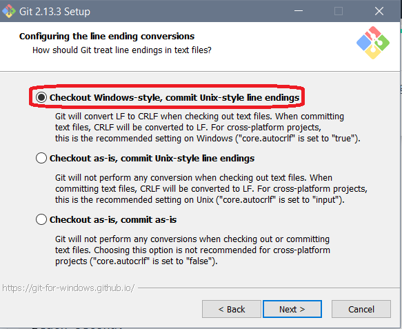
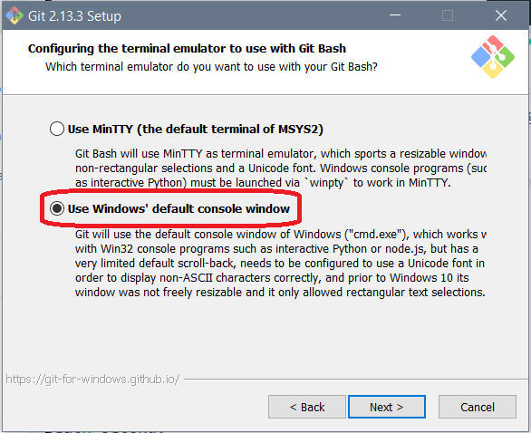

# Installing Git Bash on Windows

[Video Tutorial](https://www.youtube.com/watch?v=339AEqk9c-8)
1. Download the Git for Windows [installer](https://git-for-windows.github.io/).
2. Run the installer and follow the steps bellow:
    * Click on "Next".
    * Click on "Next"
    * Keep "Use Git and optional Unix tools from the Windows Command Prompt" selected and click on "Next". If you forgot to do this, programs that you need for the workshop will not work properly. If this happens, rerun the installer and select the appropriate option
    
    * Click "Next".
    * Keep "Checkout Windows-style, commit Unix-style line endings" selected and click on "Next".
    
    * Keep "Use Windows' default console window" selected and click on "Next".
    
    * Click on "Install".
    * Click on "Finish".
3. If your "HOME" environment variable is not set (or you don't know what this is):
    * Open command prompt (Open Start Menu then type cmd and press [Enter])
    
    * Type the following line into the command prompt window exactly as shown:
      setx HOME "%USERPROFILE%"
    * Press [Enter], you should see SUCCESS: Specified value was saved.
    
    * Quit command prompt by typing exit then pressing [Enter]
    
This will provide you with both Git and Bash in the Git Bash program.

    
